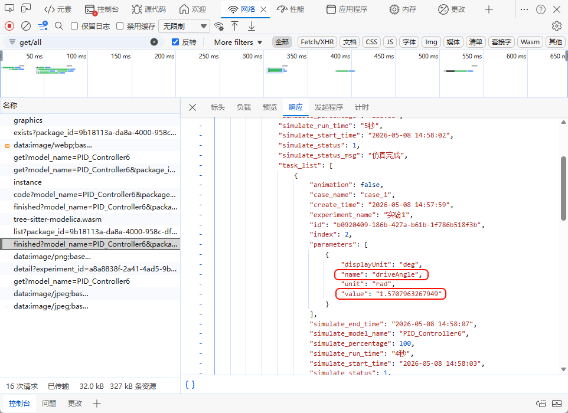
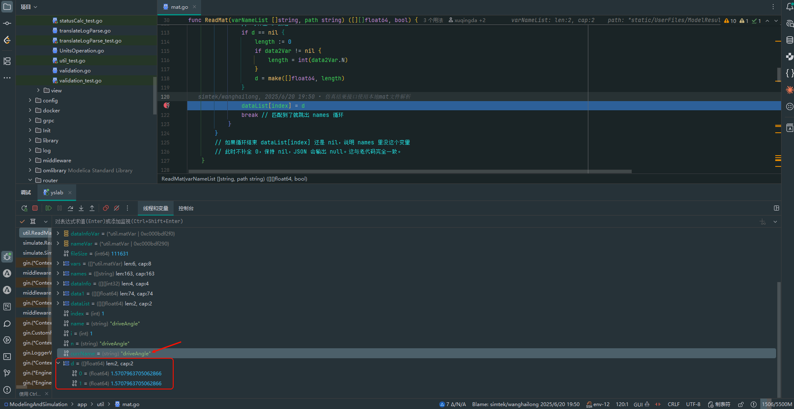
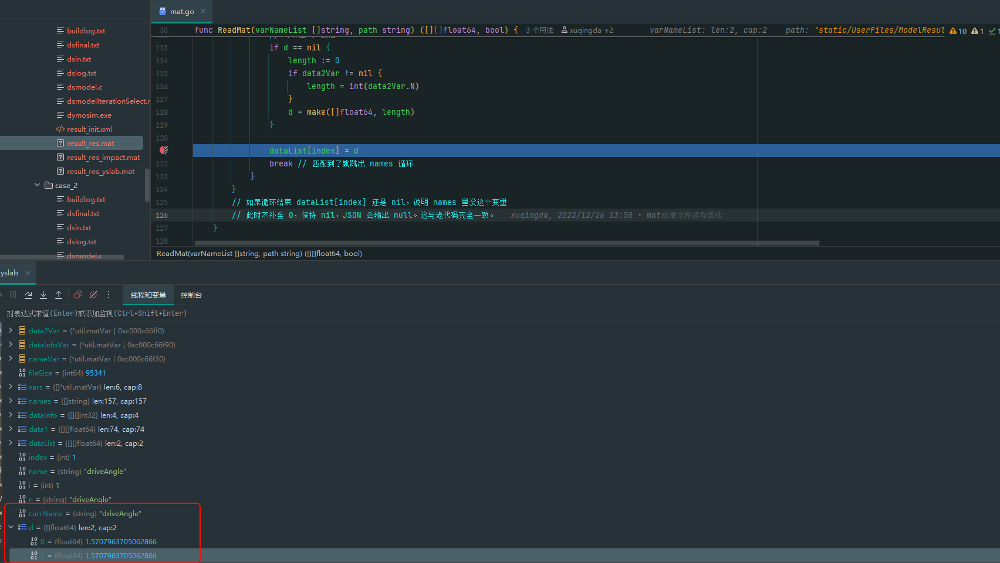
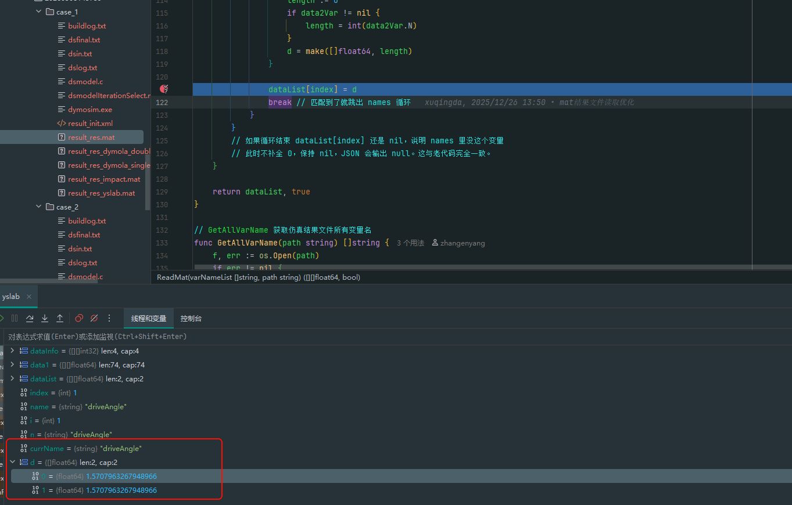
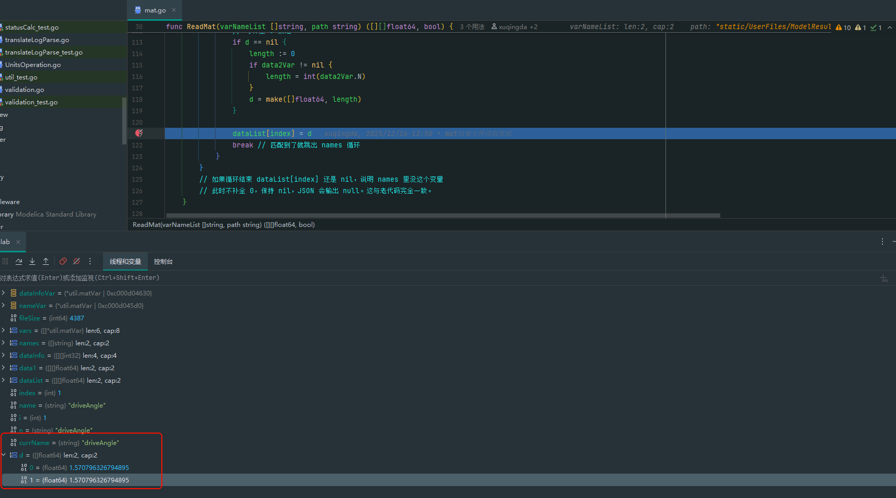

# 周五
<table class="ck-table-resized">
    <colgroup>
        <col style="width:22.16%;">
        <col style="width:25.03%;">
        <col style="width:10.78%;">
        <col style="width:8.63%;">
        <col style="width:17.94%;">
        <col style="width:15.46%;">
    </colgroup>
    <tbody>
        <tr>
            <td style="background-color:hsl(202, 73%, 78%);text-align:center;">任务</td>
            <td style="background-color:hsl(202, 73%, 78%);text-align:center;">任务细分</td>
            <td style="background-color:hsl(202, 73%, 78%);text-align:center;">优先级</td>
            <td style="background-color:hsl(202, 73%, 78%);text-align:center;">预计总时长</td>
            <td style="background-color:hsl(202, 73%, 78%);text-align:center;">开始时间--结束时间</td>
            <td style="background-color:hsl(202, 73%, 78%);text-align:center;">实际时长</td>
        </tr>
        <tr>
            <td style="text-align:center;"><ul class="todo-list"><li><label class="todo-list__label"><input type="checkbox" checked="checked" disabled="disabled">总结昨天笔记</label></li></ul></td>
            <td style="text-align:center;">&nbsp;</td>
            <td style="text-align:center;">高</td>
            <td style="text-align:center;">0.5h</td>
            <td style="text-align:center;">9：15 ---- 9：30</td>
            <td style="text-align:center;">15 min</td>
        </tr>
        <tr>
            <td style="text-align:center;"><ul class="todo-list"><li><label class="todo-list__label"><input type="checkbox" checked="checked" disabled="disabled">仿真实验改造优化</label></li></ul></td>
            <td style="text-align:center;">&nbsp;</td>
            <td style="text-align:center;">高</td>
            <td style="text-align:center;">&nbsp;</td>
            <td style="text-align:center;">&nbsp;</td>
            <td style="text-align:center;">&nbsp;</td>
        </tr>
        <tr>
            <td style="text-align:center;"><ul class="todo-list"><li><label class="todo-list__label"><input type="checkbox" checked="checked" disabled="disabled">BUG 修复</label></li></ul></td>
            <td style="text-align:center;">&nbsp;</td>
            <td style="text-align:center;">高</td>
            <td style="text-align:center;">1 天</td>
            <td style="text-align:center;">&nbsp;</td>
            <td style="text-align:center;">&nbsp;</td>
        </tr>
        <tr>
            <td style="text-align:center;"><ul class="todo-list"><li><label class="todo-list__label"><input type="checkbox" disabled="disabled">接口测试</label></li></ul></td>
            <td style="text-align:center;"><ul><li>接口测试框架完善</li><li>编写接口测试用例</li></ul></td>
            <td style="text-align:center;">高</td>
            <td style="text-align:center;">&nbsp;</td>
            <td style="text-align:center;">&nbsp;</td>
            <td style="text-align:center;">&nbsp;</td>
        </tr>
        <tr>
            <td style="text-align:center;"><ul class="todo-list"><li><label class="todo-list__label"><input type="checkbox" disabled="disabled">测试：手动补全代码格式</label></li></ul></td>
            <td style="text-align:center;">&nbsp;</td>
            <td style="text-align:center;">中</td>
            <td style="text-align:center;">&nbsp;</td>
            <td style="text-align:center;">&nbsp;</td>
            <td style="text-align:center;">&nbsp;</td>
        </tr>
        <tr>
            <td style="background-color:hsl(267, 69%, 77%);text-align:center;">&nbsp;</td>
            <td style="background-color:hsl(267, 69%, 77%);text-align:center;">&nbsp;</td>
            <td style="background-color:hsl(267, 69%, 77%);text-align:center;">&nbsp;</td>
            <td style="background-color:hsl(267, 69%, 77%);text-align:center;">&nbsp;</td>
            <td style="background-color:hsl(267, 69%, 77%);text-align:center;">&nbsp;</td>
            <td style="background-color:hsl(267, 69%, 77%);text-align:center;">&nbsp;</td>
        </tr>
    </tbody>
</table>

## 上午

## 下午

*   <a class="reference-link" href="%E5%BE%85%E5%8A%9E%E4%BA%8B%E9%A1%B9.md">待办事项</a>
    *   查看 Dymola 仿真是否存在精度丢失的问题
        
        滑块获取到的值的大小(由后端计算，使用 float64 类型存储计算后的结果)：
        
        <figure class="image"></figure>
        
        yslab 仿真的 mat 文件
        
        <figure class="image"></figure>
    *   dymola 仿真的 mat 文件
        
        <figure class="image"></figure><figure class="image"></figure>
    *   impact 仿真得到的 mat 文件
        
        <figure class="image"></figure>
        
        <table class="ck-table-resized">
            <colgroup>
                <col style="width:35.72%;">
                <col style="width:64.28%;">
            </colgroup>
            <tbody>
                <tr>
                    <td style="background-color:hsl(202, 75%, 77%);text-align:center;">获取值的方式</td>
                    <td style="background-color:hsl(202, 75%, 77%);text-align:center;">driveAngle 值</td>
                </tr>
                <tr>
                    <td style="text-align:center;">滑块</td>
                    <td>1.5707963267949</td>
                </tr>
                <tr>
                    <td style="text-align:center;">yslab/dymola 仿真(单精度浮点数)</td>
                    <td>1.5707963705062866</td>
                </tr>
                <tr>
                    <td style="text-align:center;">dymola 仿真(双精度浮点数)</td>
                    <td>1.5707963267948966</td>
                </tr>
                <tr>
                    <td style="text-align:center;">impact 仿真</td>
                    <td>1.570796326794895</td>
                </tr>
            </tbody>
        </table>
        
        单精度下，由弧度转化后的角度值：90.00000250447816
        
        双精度下，由弧度转化后的角度值：90.0000000000002

## 晚上

*   完成了 No.82 删除排序链表中的重复元素 II
*   mall 商城项目：编写日志记录中间件 ---- 未完成