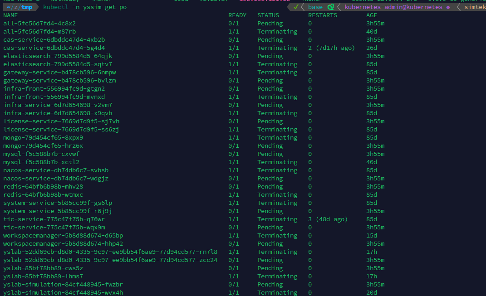
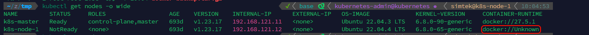
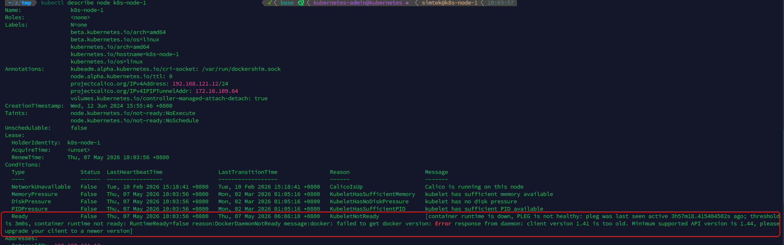
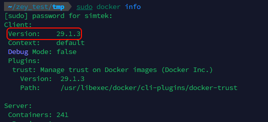
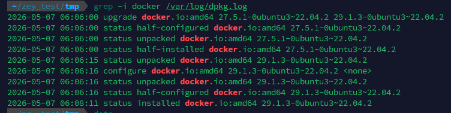
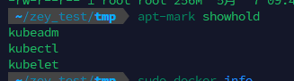
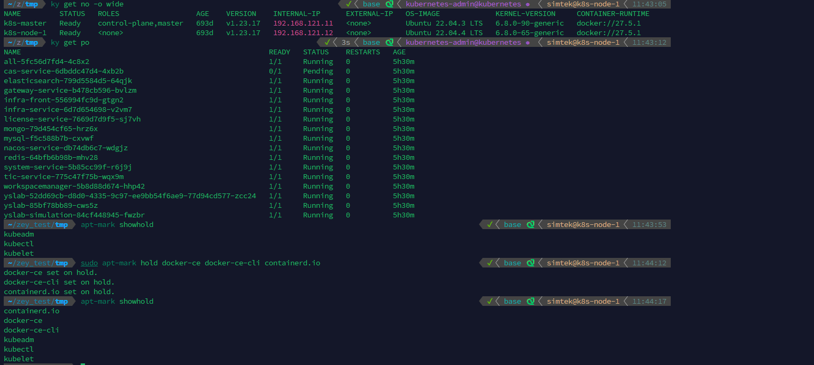

#  处理开发环境问题
## Docker 升级导致 k8s 不兼容新版 docker

### 问题描述

今早发现开发环境服务全部挂了：

<figure class="image"></figure>

### 问题排查

查看 node 情况

<figure class="image"></figure>

可见`k8s-node-1`处于`NotReady`状态。它使用的容器运行时显示为未知。

分析出问题的 k8s-node-1

```
kubectl describe node k8s-node-1
```

<figure class="image"></figure>

根据上图发现，这是由于 k8s-node-1 节点上的的 docker 客户端本太老，当前 docker 容器运行时不支持导致的。

因此，推断大概率是由于这个节点的 docker 版本意外变化导致的。查看 docker 更新日志，发现今天早上确实更新过 docker 版本：

<figure class="image"></figure><figure class="image"></figure>

查看之前是否将 docker 版本锁住，不出意外，没有锁定 docker 版本：

<figure class="image"></figure>

那么问题就很明确了，docker 版本被更新，而该节点使用的 k8s 版本`1.23.17` 不支持 docker 更新后的的`29.1.3`版本，需要将 docker 版本降级。

### 问题解决

参考<a class="reference-link" href="#root/GBOUjCprZIYW/91mPYWEqKIYv/8YDbUaWT9Fun/ddyezAIVNLjR/iEZREjBPgRjx">安装过程中遇到的问题</a>中给出的 docker 版本降级方法，将开发环境的 docker 版本降为`27.5.1`，与`master`节点保持一致.

> k8s 官方推荐的 docker 版本为 20.10.x 版本

安装完毕后，固定 docker 版本，避免未来可能再次升级 Docker

<figure class="image"></figure>

经验证，docker 版本降级后